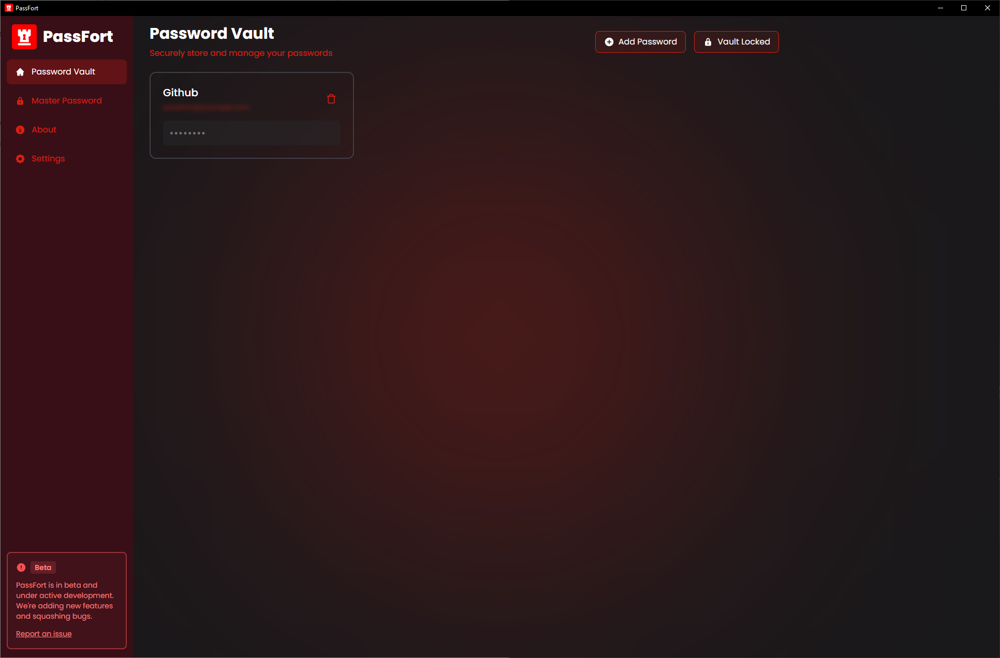
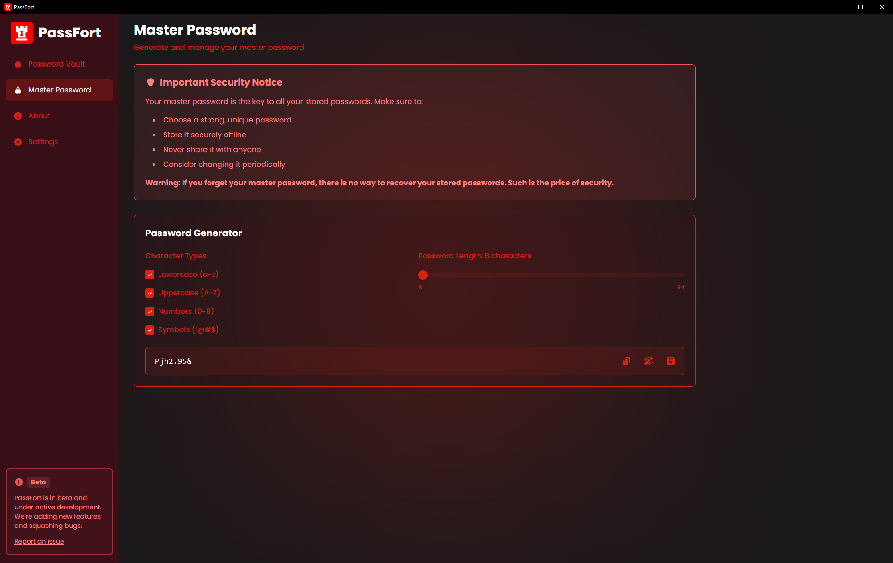
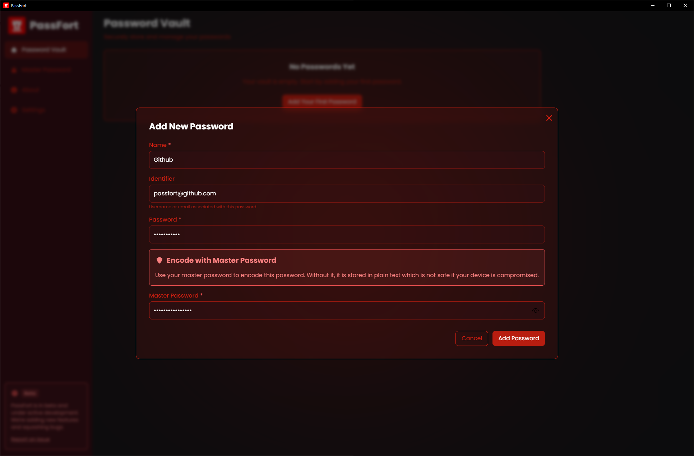
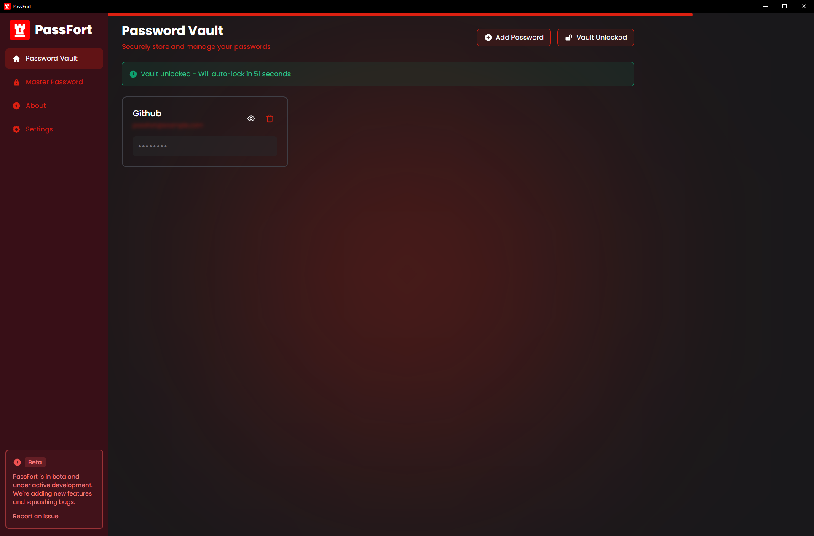

  
  <h1>PassFort</h1>
  
A secure, encrypted, and offline-first password manager

## **Overview**

PassFort is a free and open-source desktop application that helps you securely manage and store passwords. Using AES-256 encryption and running completely offline, PassFort ensures your credentials remain private and secure.

## **Features**

-   🔒 **Secure Storage**: AES-256 encryption for all stored passwords
-   🔐 **Master Password**: Single master password to access all your credentials
-   🌐 **Cross-Platform**: Available for Windows, macOS, and Linux
-   ⚡ **Fast & Offline**: Works without internet connection
-   🎯 **Auto-Lock**: Automatic locking after inactivity
-   🔄 **Password Generator**: Built-in secure password generation
-   ∞ **Unlimited Storage**: However many passwords is store is entirely determined by your system.

## **Installation**

### System Requirements

-   Windows 10/11, MacOS 10.15+, or Linux
-   200MB free disk space
-   2GB RAM minimum

### Download

The easiest way to run Passfort is to download our pre-compiled binaries that best suit your operating system from our [releases page](https://github.com/BrianTib/passfort/releases).

### Building a development environment

If you're directly pulling from the repository to either contribute or build the project locally, follow these steps.

(*P.S. These steps assume that you've already pulled the repo and that you have Rust and pnpm installed*)

1. Since all of the icon variations are no longer pushed to GitHub to save resources, use the following command to build all the necessary icons

   - `cargo tauri icon`

2. Install dependencies

   - `pnpm install`

3. Run the application in development mode
   - `cargo tauri dev`

## **Usage**

1. **First Launch**: Create your master password
   

2. **Adding Passwords**: Click the "+" button or "Add new password" to add new credentials
   

3. **Viewing Passwords**: Access your vault using your master password
   

## **Security**

-   All passwords are encrypted using AES-256
-   Master password is never saved to disk by the application
-   No cloud storage or network connectivity required
-   Regular security audits and updates by our community members

## **Important Notice**

⚠️ **Your master password cannot be recovered if lost**. Make sure to:

-   Store it securely
-   Never share it with anyone

## **Contributing**

Contributions will be welcome after the 100.0.0 release. Please read our [Contributing Guidelines](./.github/CONTRIBUTING.md) for more information.

## **License**

PassFort is licensed under the GNU General Public License v3.0 - see the [LICENSE](./LICENSE) file for details.

## **Support**

- 🐛 [Report Issues](https://github.com/BrianTib/passfort/issues)
- 💡 [Feature Requests](https://github.com/BrianTib/passfort/issues)

- 📧 [Become a sponsor! (Reach me personally by e-mail)](bptiburcio@gmail.com)

---

Made with ❤️ by [Brian T.](https://github.com/BrianTib) and (soon) contributors.
